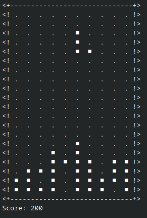

# CTetris
My custom Tetris implementation in C, designed to run entirely in the UNIX terminal.

### Gameplay:
The core gameplay plays just like normal Tetris.

Every line cleared is 100 points. 
Example: if 3 lines cleared == 300 score.

Every 1000 score the game will get faster.
When the speed is increased 10 times the game will not get faster anymore, the maxium speed has been reached.

### Controls:
- `A` --> **move left**
- `D` --> **move right**
- `S` --> **more down**
- `X` --> **rotate**
- `E` --> **exit**

### About:
I started this project as a challenge to myself to make my own Tetris clone since I like the simple design of the game. I specifically chose C since I wanted to get more comfortable with it, as I want a career in embedded/low-level programming. I learned a lot and got quite comfortable with C, so I would say I reached my goal.

### Game screenshot:
